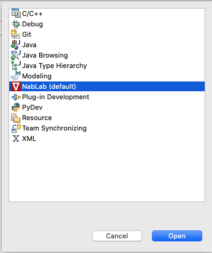
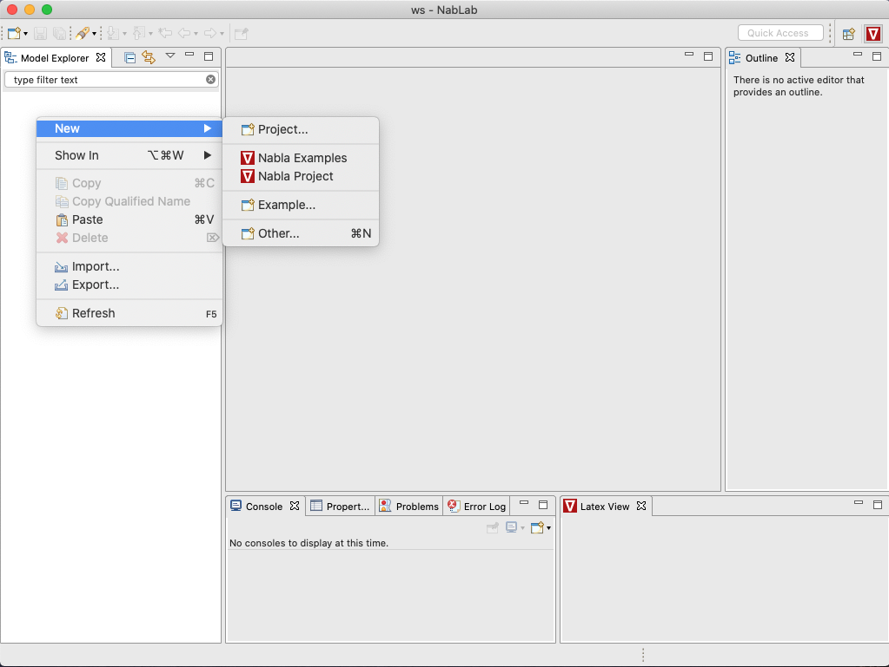
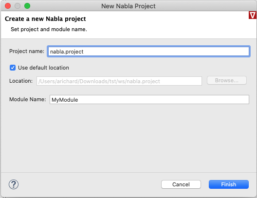
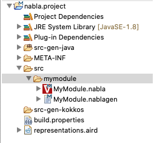
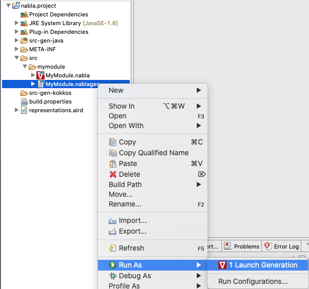
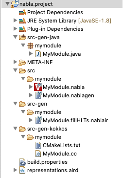
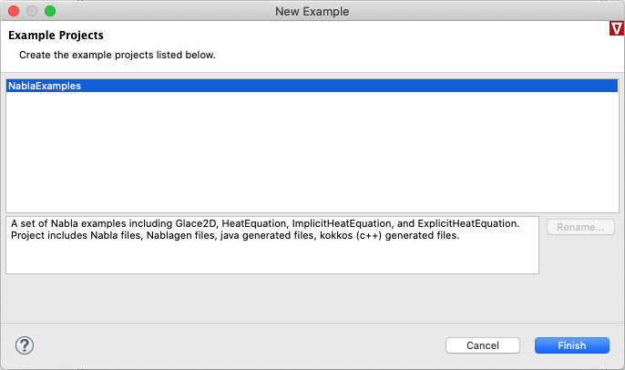
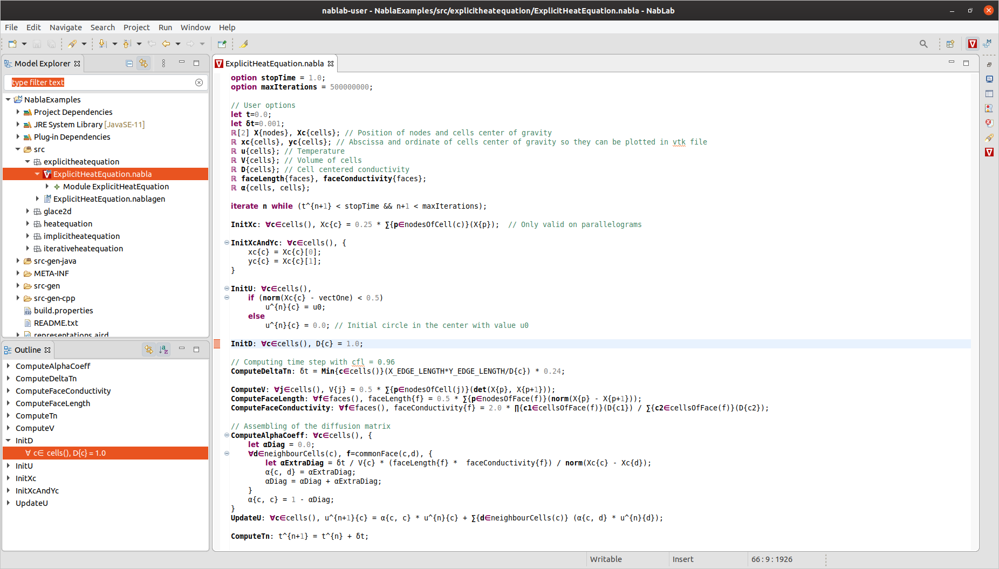
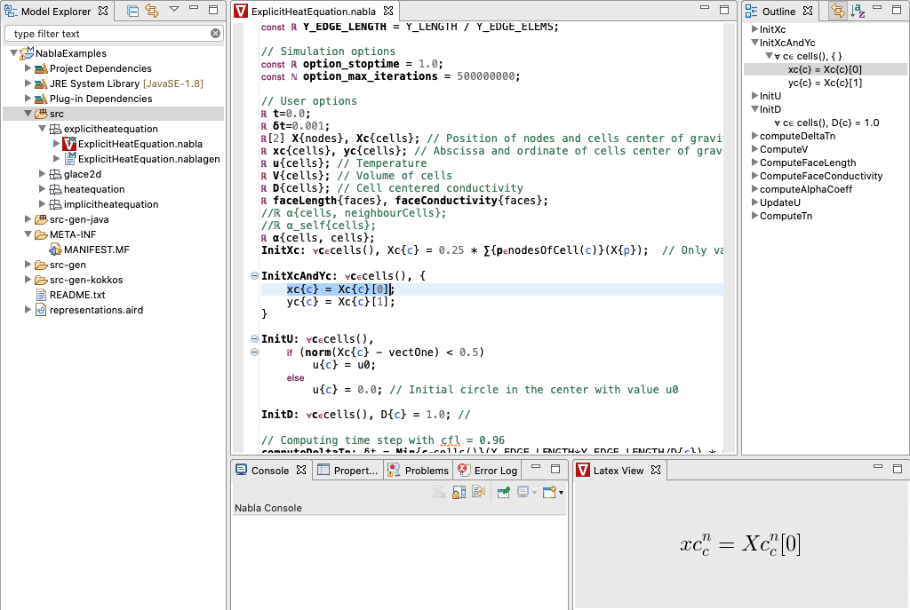

# NabLab

Written by CEA and Contributors

(C) Copyright 2019, by CEA. All rights reserved.

All content is the property of the respective authors or their employers.
For more information regarding authorship of content, please consult the
listed source code repository logs.

## Introduction

NabLab is a full-fledged industrial environment for scientific computing and High Performance Computing based on [Eclipse](https://www.eclipse.org/).

This program and the accompanying materials are made available under the terms of the Eclipse Public License v. 2.0 which is available at https://www.eclipse.org/legal/epl-v20.html.

SPDX-License-Identifier: EPL-2.0

Please refer to the license for details.

## Getting started

The latest NabLab environment can be downloaded [here](https://github.com/cea-hpc/NabLab/releases/tag/v0.2.1). For Mac users, depending on your security configuration, you have to enter the following command to execute NabLab: `xattr -d com.apple.quarantine NabLab.app`.

Once the NabLab environment has been launched, the NabLab perspective should be selected. If it is not the case, just select the NabLab perspective from the *Window > Perspective > Open Perspective > Other ... > NabLab* menu.

The NabLab perspective provides a set of *Views* and wizards shortcuts allowing to easily create and develop nabla models.

### Create a new project

From the *Model Explorer View* in the *NabLab* perspective, just right-click and select *New > Nabla Project* to create a new project:

You can also create it from the *File > New > Nabla Project* main menu.

A new wizard is launched, asking for a project name and a module name:

Just click on the *Finish* button to create the new project. The new project is available in the *Model Explorer View*:

It contains two models (*MyModule.nabla*, and *MyModule.nablagen*) in the *nabla.project/src/mymodule/* folder.

To launch the java and kokkos source code generations corresponding to the nabla module, just right-click on the *nabla.project/src/mymodule/MyModule.nablagen* and select *Run As > Launch Generation*

The java and kokkos source code files are generated in *src-gen-java* and *src-gen-cpp* folders respectively.

### Examples project

From the *Model Explorer View* in the *NabLab* perspective, just right-click and select *New > Nabla Examples* to import the examples project:

You can also import it from the *File > New > Nabla Examples* main menu.

A new wizard is launched:

Just click on the *Finish* button to import the examples project. The examples project is available in the *Model Explorer View*:

It contains a set of Nabla examples including Glace2D, HeatEquation, ImplicitHeatEquation, and ExplicitHeatEquation.

### Latex View

The *Latex View* is located on the bottom right corner of the NabLab environment. It allows to visualize in an elegant way the nabla formulas contained in a *nabla* model.

The *Latex View* is accessible through the *Window > Show View > Other... > Nabla > Latex View* main menu.

This view is automatically updated and synchronized with the selection in the current nabla model editor.

## Build via Maven 3.x

To build the NabLab products for Windows/Linux/MacOS and the Eclipse update-site, you can run the following command from the root of the repository:
`mvn clean; mvn verify`.

Note the `';'` after `mvn clean`. 

The products resulting from the build will be accessible in */releng/fr.cea.nabla.updatesite/target/products/NabLab-1.0.0.yyyymmddHHMM-YOUR_PLATFORM.zip*.

The Eclipse update-site resulting from the build will be accessible in */releng/fr.cea.nabla.updatesite/target/fr.cea.nabla.updatesite-1.0.0.yyyymmddHHMM.zip*.

Just install this update-site in an Eclipse 2020-03 with Sirius 6.3.0 and Xtext 2.21.0 already installed to use NabLab.

If you want to skip tests execution, you can run the following command:
`mvn clean; mvn verify -Dmaven.test.skip=true`

## Dependencies

NabLab requires Java 11 or later to build & run. 

It as based on:

Eclipse 2020-03
 * License: EPL-2.0
 * Project: https://www.eclipse.org/downloads/packages/release/2020-03/r

Xtext (2.21)
 * License: EPL-2.0
 * Project: http://projects.eclipse.org/projects/modeling.tmf.xtext
 * Source: https://github.com/eclipse/xtext

Sirius (6.3.0)
 * License: EPL-2.0
 * Project: http://projects.eclipse.org/projects/modeling.sirius
 * Source: https://git.eclipse.org/c/sirius/org.eclipse.sirius.git

JGraphT (1.3.0)
 * License: LGPL-2.1, EPL-2.0
 * Project: http://jgrapht.org
 * Source: https://github.com/jgrapht/jgrapht

JLatexMath (1.0.7)
 * License: GPL-2.0
 * Project: http://www.scilab.org/projects/thirdparty_project/jlatexmath
 * Source: https://github.com/opencollab/jlatexmath

Commons-Math3 (3.6.1)
  * License: Apache v2
  * Project: https://commons.apache.org/proper/commons-math/
  * Source: https://github.com/apache/commons-math
